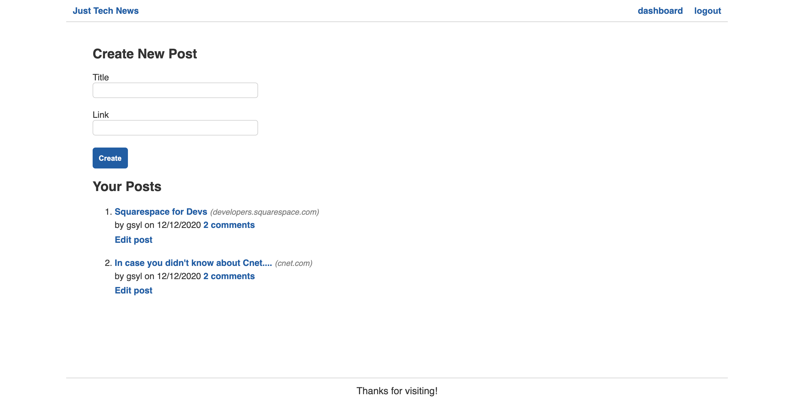

# Tech-blog
 

## Description
Welcome to Tech-Blog! Tech-Blog was created with web developers in mind. In order to participate an account must be created. Once logged in the user will be redirected to the dashboard where they have the ability to create new posts. Alternatively the user can click on the logo to browse recent community postings. Once a post is clicked on, the user will be redirected to a discussion board where they can reply to the post or post comments. Tech-Blog is a full-stack application created following the MVC paradigm. It utilizes a MySQL/Sequelize database that is accessed through a RESTful API structure. An Express server framework is implemented in the Node.js backend to create a simple, scalable, application. Dotenv is used as a dependency for the .env file and Bcrypt is implemented for password protection.  

## Table of Contents
  - [Usage](#Usage)
  - [Installation](#installation)
  - [Technology Used](#technology-used)
  - [Questions](#questions)
  - [Links](#links)
  - [License](#license)
  
## Usage

#### Application Homepage:

#### Application Dashboard:

## Installation

Node.js, NPM, and MySql must be installed on your computer.   
 Navigate to directory you wish to save the clone to.   
  `git clone https://github.com/CFsylvester/tech-blog`  
 Use npm install to install dependecies.  
  `npm install`  
 Log into MySQL.  
  `mysql -u <user> -p `  
Enter password.  
 Source the schema.  
  `source db/schema.sql`  
 Quit MySQL and seed the database.   
  `quit
  node seeds`   
 Start the server.  
  `npm start`

## Technologies Used

   

 

 ## Questions
  Please reach out to me at [clairesylvester@clairecodes.dev](mailto:clairesylvester@clairecodes.dev?subject=[GitHub%tech-blog]%20Source%20Han%20Sans)

  ## Links
  - **[Deployed App](https://sylvester-tech-blog.herokuapp.com/)**
  - **[GitHub Repo](https://github.com/CFsylvester/tech-blog)**
  - **[My Portfolio](clairecodes.dev)**
  - **[Connect on LinkedIn](https://www.linkedin.com/in/claire-sylvester-386373143/)**
  - **[GitHub profile](https://github.com/CFsylvester)    **

  ## License 
  This application uses the MIT license.  
