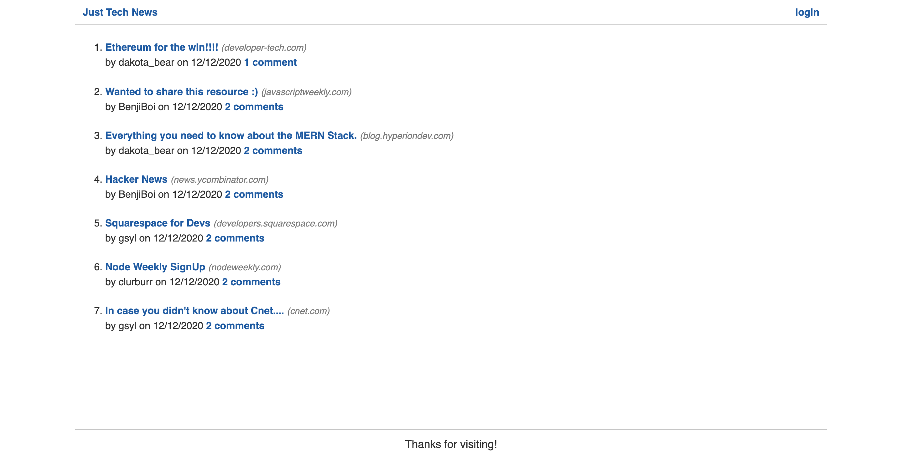

# Tech-blog

Welcome to Tech-Blog! Tech-Blog was created with web developers in mind. In order to participate in the discussion an account must be created. Once logged in the user will be redirected to the dashboard where they have the ability to create new posts. Alternatively the user can click on the logo to browse recent community postings. This user-based website was created by Claire Sylvester as a full-stack project for UPENN's Coding Bootcamp.

[Tech-Blog Active Link](https://sylvester-tech-blog.herokuapp.com/)



## Installation

[Repository Link](https://github.com/CFsylvester/tech-blog)

Click clone or download repository. 

Access terminal.  

Navigate to directory you wish to save the clone to.  
Use npm i to install dependecies. 
Log into MySQL.
Enter password. 
Source the schema.
Quit MySQL and seed the database.
Start the server.

```bash
git clone <paste url here>
npm i
mysql -u <user> -p 
source db/schema.sql
quit
node seeds
npm start
```


## Technologies Used

* Bycrypt
* Sequelize
* Handlebars
* Express
* Jest
* MySQL
* Dotenv


## License 
[MIT](./LICENSE)